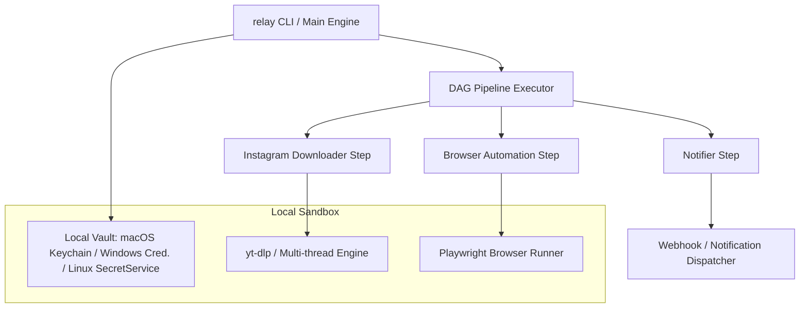

# Relay

<p align="center">
  <strong>Local-First Workflow Automation Engine</strong><br />
  A fast, modular, and privacy-first CLI platform to automate browser tasks, downloads, and social pipelines entirely on your machine.
</p>

<p align="center">
  
  
  
  
</p>

---

Relay is a developer-focused, extensible CLI engine for orchestrating complex automations without relying on cloud servers or subscription platforms. Every action—from logging into a site and fetching media to downloading videos and updating metadata—is structured as a **Step**. You compose these steps into a Directed Acyclic Graph (DAG) pipeline, and Relay handles execution, logging, state, and credentials locally.

```text
    [ Instagram URL ] ────> [ Download Step ] ────> [ Video File ]
                                                           │
                                                           ▼
    [ Success Notify ] <─── [ Studio Upload ] <──── [ Form Metadata ]
```

---

## Download & Quick Install

Relay is distributed as a single precompiled binary. You do not need Python, Node.js, or any system package managers installed to use it.

### macOS and Linux
```bash
curl -fsSL https://raw.githubusercontent.com/ntbnaren7/relay/main/install.sh | bash
```

### Windows (PowerShell)
```powershell
iwr https://raw.githubusercontent.com/ntbnaren7/relay/main/install.ps1 -useb | iex
```

*Note: Once installed, type `relay` to launch the interactive prompt. Run `relay update` at any time to check and install upgrades.*

---

## Interactive Command Line Interface

Relay features a responsive, rich terminal interface built for rapid task execution and monitoring:

```text
  ┌─────────────────────────────────────────────────────────────┐
  │  RELAY v0.2.3 • Local Workflow Automation Engine            │
  ├─────────────────────────────────────────────────────────────┤
  │                                                             │
  │  [Pipelines]                                                │
  │   ▸ insta-to-youtube      Cross-post Reels to YT Shorts     │
  │   ▸ tiktok-to-shorts      Sync TikTok videos to Shorts      │
  │                                                             │
  │  [Active Operations]                                        │
  │   ⠋ [downloader] Fetching media from Instagram... 42%       │
  │   ✔ [vault] Retrieved YouTube credentials from OS Keychain   │
  │                                                             │
  │  [Status Log]                                               │
  │   12:04:12 [INFO] Browser session started successfully.     │
  │   12:04:15 [INFO] Upload completed. video_id=x9K3j8L2a      │
  │                                                             │
  └─────────────────────────────────────────────────────────────┘
```

---

## Core Capabilities

### 1. Zero-Trust Local Vault
Credentials, API tokens, and session cookies are never exposed to external servers or cloud databases:
* **Host Keychain Integration**: Relay hooks directly into your native operating system credential vault (macOS Keychain, Windows Credential Manager, or Linux Secret Service).
* **Automatic Fallback**: In headless Linux servers, Docker containers, or CI runners where Keychains are unavailable, Relay falls back to a restricted plaintext configuration file (`~/.relay/secrets.json` locked with `0o600` permissions).
* **Zero-Config Migration**: Plaintext credentials from older legacy files are automatically migrated to your system keychain and deleted from disk upon first run.

### 2. High-Performance Automation Engines
* **Resilient Downloader**: Integrates native multi-threaded downloader layers with built-in retry schedules, chunked progress tracking, and fallback engines for high-quality audio and video retrieval.
* **Persistent Browser Contexts**: Utilizes isolated browser profiles with Playwright to maintain login states (cookies, local storage, device finger-prints) safely across execution runs.

### 3. Declartive & Composable Pipelines
Configure and launch workflows via direct commands or clean configuration trees:
```bash
# Run a cross-platform synchronization pipeline with one command:
relay pipeline run insta-to-youtube --url "https://instagram.com/p/ExampleReel"
```

---

## Architecture Diagram



---

## Developer Guide & Commands

Manage your workflows, execution runs, and configurations using the command-line interface:

### Storing Credentials in the Vault
```bash
# Store a credential securely in your OS keychain:
relay vault set youtube studio_cookie "session_cookie_data_here"

# Retrieve stored values:
relay vault get youtube studio_cookie
```

### Listing Available Workflows
```bash
# Display all registered pipelines, automation components, and tools:
relay list
```

### Self-Updating
```bash
# Check version and upgrade the binary to the latest GitHub Release:
relay update
```

---

## Security & Privacy Statement

Relay is built on local-first and privacy-by-default architecture.
1. No telemetry or execution logs are ever transmitted outside your machine.
2. Browser automation sessions are run in your local user directory, preserving cookie privacy.
3. Keyring integration ensures your high-value secrets (like YouTube tokens or API keys) remain protected under hardware/system-level encryption.

