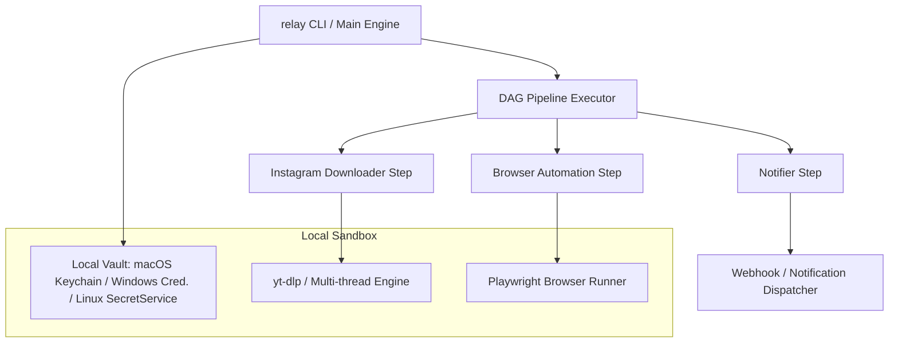

<div align="center">

# ⚡ Relay

### **Your Content, Anywhere. Powered Locally.**

Relay is a privacy-first, zero-dependency engine that synchronizes your social media content across platforms directly from your machine. No cloud servers, no subscriptions, no leaked session cookies.

[](LICENSE)
[](#download--quick-install)
[](#)
[](#)

---

[Quick Install](#download--quick-install) • [Core Features](#the-relay-experience) • [How it Works](#the-relay-engine) • [Commands](#developer-reference)

---

</div>

<br />

## The Relay Experience

Relay bridges platforms seamlessly, allowing you to easily republish your content without compromising security.

<table>
  <tr>
    <td width="50%">
      <h3>Hardware-Secured Vault</h3>
      <p>Your passwords, access tokens, and cookies remain fully encrypted using your machine's native hardware vault (macOS Keychain, Windows Credential Manager, or Linux Secret Service).</p>
      <kbd>Zero-Trust Security</kbd>
    </td>
    <td width="50%">
      <h3>Stealth Browser Automation</h3>
      <p>Automate logins and media publishing in an isolated, anti-detect browser environment. Persistently retains session cookies across runs so you only log in once.</p>
      <kbd>Anti-Detection Layers</kbd>
    </td>
  </tr>
  <tr>
    <td width="50%">
      <h3>Standalone Executable</h3>
      <p>Relay compiles into a single precompiled binary. No Python, Node.js, or complex dependencies required to get started.</p>
      <kbd>Self-Contained Binary</kbd>
    </td>
    <td width="50%">
      <h3>Resilient Multi-Thread Engine</h3>
      <p>Download video files with multi-threaded chunking, custom retries, and automated video transcoding to prepare files for platform ingestion.</p>
      <kbd>Smart Transcoding</kbd>
    </td>
  </tr>
</table>

<br />

## Live Dashboard Preview

Here is how Relay tracks active workflows in your terminal:

```text
  ┌─────────────────────────────────────────────────────────────┐
  │  RELAY v0.2.4 • Local Workflow Automation Engine            │
  ├─────────────────────────────────────────────────────────────┤
  │                                                             │
  │  [Pipelines]                                                │
  │   ▸ insta-to-youtube      Cross-post Reels to YT Shorts     │
  │   ▸ tiktok-to-shorts      Sync TikTok videos to Shorts      │
  │                                                             │
  │  [Active Operations]                                        │
  │   ⠋ [downloader] Fetching media from Instagram... 42%       │
  │   ✔ [vault] Retrieved YouTube credentials from OS Keychain   │
  │                                                             │
  │  [Status Log]                                               │
  │   12:04:12 [INFO] Browser session started successfully.     │
  │   12:04:15 [INFO] Upload completed. video_id=x9K3j8L2a      │
  │                                                             │
  └─────────────────────────────────────────────────────────────┘
```

<br />

## Download & Quick Install

Get up and running with a single copy-paste command. The installer automatically places Relay on your path and configures system security parameters.

### macOS and Linux
```bash
curl -fsSL https://raw.githubusercontent.com/ntbnaren7/relay/main/install.sh | bash
```

### Windows (PowerShell)
```powershell
irm https://raw.githubusercontent.com/ntbnaren7/relay/main/install.ps1 | iex
```

*Note: Relay automatically downloads and installs its own Chromium instance when you run your first pipeline, eliminating manual configuration.*

<br />

## The Relay Engine

Relay maps workflows as Directed Acyclic Graphs (DAGs), coordinating downloads, formats, security context, and uploads dynamically.



<br />

## Developer Reference

<details>
<summary><b>🔑 Credential Vault Management</b></summary>
<br />

Store secrets directly inside your hardware OS keychain:
```bash
# Save your session data safely:
relay vault set youtube studio_cookie "session_cookie_data_here"

# Retrieve registered keys:
relay vault get youtube studio_cookie

# List stored vault keys (values are hidden):
relay vault list
```
</details>

<details>
<summary><b>🎬 Running Workflows</b></summary>
<br />

Execute a pipeline directly with flags:
```bash
relay run insta_to_youtube --url "https://instagram.com/p/ExampleReel"
```
Or run `relay` with no arguments to use the interactive terminal selector.
</details>

<details>
<summary><b>🔄 Self-Updating</b></summary>
<br />

Check for upgrades and download the latest standalone binary releases directly:
```bash
relay update
```
</details>

<br />

<div align="center">

---

Designed with ⚡ by the Relay Community. Distributed under the MIT License.

</div>
